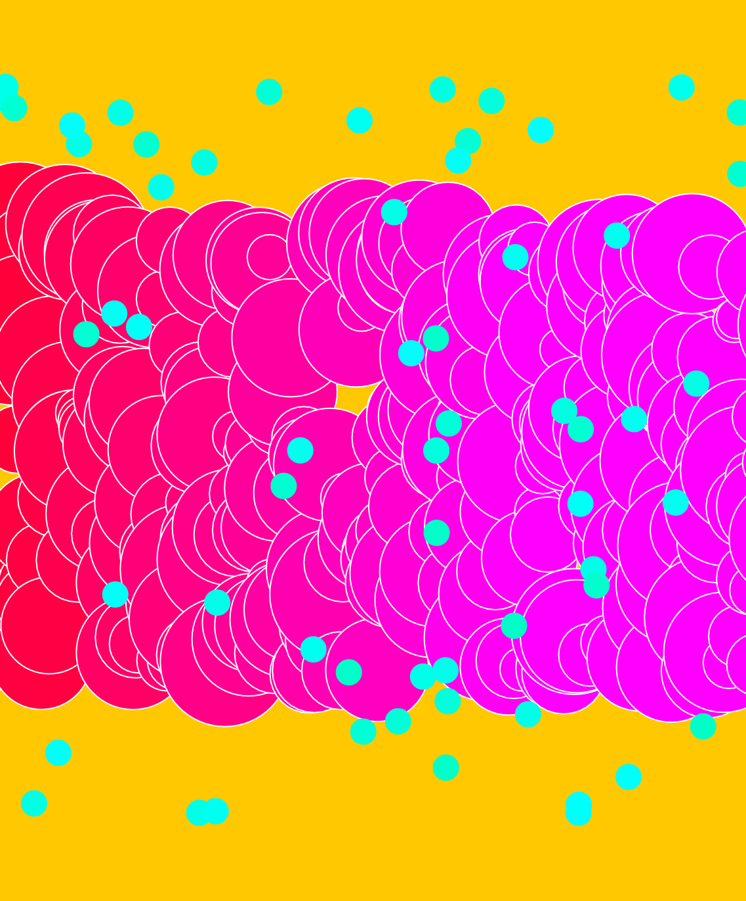

# Vector Graphics
*Digest 8*

*Notes: This week's digest is about my p5.js experience.*
- p5.js is a javascript extension library for artist to code creatively using vector graphics technology. I experienced with p5.js a little to have a basic understanding of how to code with vector images. It's very interesting to just code in texts but get a result of graphics.

- Below are some images I created with js.p5:

