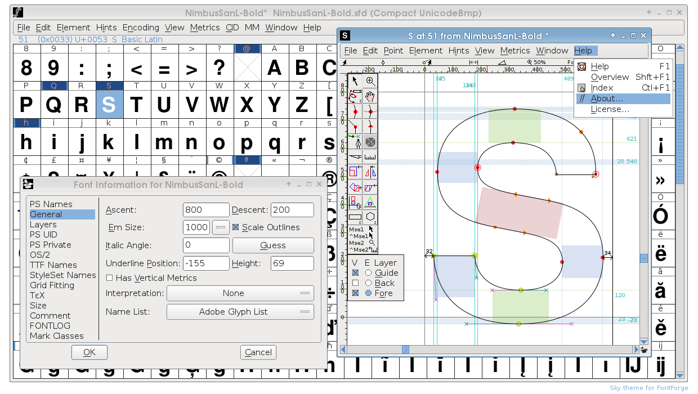

# Vector Graphics
*Guiding Questions - Jiarui Wang*

**1. Briefly explain the main idea behind the technology you're researching, what is it exactly? what is it for? How does it work?**

Vector graphic is a type of technology that uses a special kind of polygons to make images in computer graphics. Each of the points in the polygons have a definite position on a coordinate. Thus, images created by this technology will not lose its quality when being enlarged.

**2. Who are the important people and/or organizations related to this technology? Don't just list names, briefly explain who these are and what their relationship to your research area is.**

Vector graphics were first used in specialized or military systems like the US air defense system in the 1960s to 1970s. During the same time, Ivan Sutherland also used vector graphics in his patented software, Sketchpad, which can be used in both artistic and technologic ways. He was also regarded as the father of computer graphics.

**3.What are the important historical events/milestones in the development of this technology and why do they seem particularly note worthy?**

One of the most notable milestones of the development of computer graphics is the invention of Sketchpad by Ivan Sutherland. The software redefined way of operating and interacting with computer by using a graphic user interface for the first time.

*(Ivan Sutherland demonstrating the use of Sketchpad)*

During 1980s to 1990s, programs like Icarus, Adobe Illustrator and Aldus Freehand were introduced as important tools to transit traditional typefaces into digital forms, so that they could be displayed and used on computer screens.

*(FontForge, a modern program for type design)*

**4. Draw (literally or figuratively) connections between the technology you are researching and other related technology. This could include sub-categories within your research area and/or technological predecessors and/or technology which is otherwise related to your area.**

Vector graphics are considered very important because it connects to almost every aspect of our use of computer related technologies. It is the indispensable part of the invention of graphic user interface. The software Sketchpad mentioned above, also derived modern object-oriented programming. It is also strongly related to typography and art making in the modern world.

### Resources:
[Vector Graphics Wikipedia Page](https://en.wikipedia.org/wiki/Vector_graphics) |
[Ivan Sutherland Wikipedia Page](https://en.wikipedia.org/wiki/Ivan_Sutherland) |
[Sketchpad Wikipedia Page](https://en.wikipedia.org/wiki/Sketchpad) |
[A Short History of Vector Graphics](http://www.coalesceideas.com/a-short-history-of-vector-graphics/) |
[The History of Art - Vector Graphics](https://domism.deviantart.com/journal/The-History-of-Art-Vector-Graphics-273798055)
